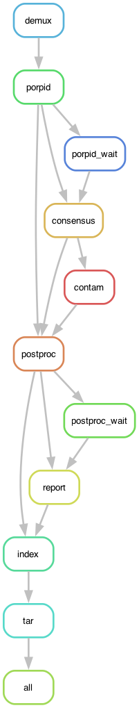

# PORPIDpipeline

by Alec Pankow and Ben Murrell, now maintained by Hugh Murrell

now upgraded to Julia version 1.10.5

## Branch: master (including the new artefactfilter)

## Quick start

### Dependencies (on an ubuntu machine)

- first update all apps
   - `apt update`
   - `apt upgrade`
- Snakemake
   - `apt-get install -y snakemake`
- python3 packages
  - `apt-get install python3-pandas`
  - `apt-get install python3-seaborn`


### Julia version 1.10.5

We recommend you use the `juliaup` version manager to install julia.
from a terminal you can do this as follows:

```bash
curl -fsSL https://install.julialang.org | sh
```

This should install the Julia version manager, `juliaup` as well as
the latest version of Julia. To find out how to use the version manager 
to makesure you have version 1.10.5 as your default, go here:

[https://github.com/JuliaLang/juliaup]

Once Julia is installed, make sure you can enter the julia REPL from 
the command line and check the version number by logging out and in again 

```bash
exit
ssh root@.....
```

and then from your new terminal session:

```bash
juliaup status
julia --version
```

If the version number is not 1.10.5 then you need to use `juliaup` to install
that version and make it the default. 

```bash
juliaup add 1.10.5
juliaup default 1.10.5
```

for further details concerning `juliaup` go here:

[https://github.com/JuliaLang/juliaup?tab=readme-ov-file#using-juliaup]

### cloning the PORPIDpipeline repository

Now that the dependencies are setup we clone the PORPIDpipeline repository

```bash
git clone https://github.com/MurrellGroup/PORPIDpipeline.git
```

### setting up the Julia package environment

then navigate to the `PORPIDpipeline` project folder and start the Julia REPL. 
Enter the package manager using `]` and then enter

```julia
activate .
instantiate
precompile
```

This will activate, install, and precompile the `julia` environment specified by the 
`Project.toml` and `Manifest.toml` files. The `precompile` command
above is not strictly needed but is useful if there are issues with installing
the `julia` packages listed in `Project.toml`

### Workflow

The graph below summarizes the overall organization of the workflow. 
Each node in the graph is a *rule* in the The [Snakefile](Snakefile).



Snakemake makes use of a `Snakefile` and a `config` file to specify 
input and output files for each rule and to set parameters for each 
rule in the workflow. Global parameters that can be changed by the 
user editing the `Snakefile` are as follows:

```
# PORPIDpipeline parameters
# demux
chunk_size = 100000      # default 100000
error_rate = 0.01        # default 0.01
min_length = 2100        # default 2100
max_length = 4300        # default 4300
max_reads = 100000       # default 100000 reads per sample,
verbose = "false"        # default "false", use "true" to debug demux
#porpid
fs_thresh = 1            # default 1 (or use 5 if af_thresh is 0)
lda_thresh = 0.995       # default 0.995
#consensus
agreement_thresh = 0.7   # default 0.7
af_thresh = 0.35         # default 0.35 (drops smallest 35% of CCS reads)
#contam
cluster_thresh = 0.015   # default 0.015
proportion_thresh = 0.2  # default 0.2
dist_thresh = 0.015      # default 0.015
contam_toggle = "on"     # default "on", use "off" to disable
#postproc
panel_thresh = 50        # default 50
#tar
degap = "true"           # default "true", use "false" to disable
collapse = "true"        # default "true", use "false" to disable
porpid_archive = "full"  # default "full", use "part" for partial archive
```

Note that with the advent of PacBio Revio sequencer, the number of reads
per sample has grown to outstrip memory available on standard CPUs. 
To enable a trouble free pipeline run, we now allow the user to specify
the maximum number of reads per sample using the `max_reads` parameter above.
Samples with reads exceeding this limit are then randomly sub-sampled to
reduce the number of reads accordingly.

We also introduce the option of a **partial** archive of the intermediate
**porpid** directory. This option is made available to ameliorate the 
inordinately long time it can take to archive and gzip the huge directory
structures produced when processing PacBio Revio datasets.

### Sample configuration

Parameters for each sample are provided in the `config.yaml` file. This file
should reflect your library construction, amplicon identity and any override
parameter settings. 

It should follow the same format shown in the **demo** example below.

```yaml
demo:
  donor_1_REN:
    cDNA_primer: CCGCTCCGTCCGACGACTCACTATAacagtgNNNNNNNNGTCATTGGTCTTAAAGGTACCTG
    sec_str_primer: TAGGCATCTCCT
    panel: "panels/HIV1_COM_2017_5970-8994_DNA_stripped.fasta"
  donor_2_REN:
    cDNA_primer: CCGCTCCGTCCGACGACTCACTATAcactcaNNNNNNNNGTCATTGGTCTTAAAGGTACCTG
    sec_str_primer: TAGGCATCTCCT
    panel: "panels/HIV1_COM_2017_5970-8994_DNA_stripped.fasta"
    af_override: 0.4
  donor_3_REN:
    cDNA_primer: CCGCTCCGTCCGACGACTCACTATAggtagcNNNNNNNNGTCATTGGTCTTAAAGGTACCTG
    sec_str_primer: TAGGCATCTCCT
    panel: "panels/HIV1_COM_2017_5970-8994_DNA_stripped.fasta"
  donor_1_GP:
    cDNA_primer: CCGCTCCGTCCGACGACTCACTATAacagtgNNNNNNNNGTATGTCATTGACAGTCCAGC
    sec_str_primer: TTGACTAGCGGAGGCTAGAAGGAGA
    panel: "panels/HIV1_COM_2017_787-3300_DNA_stripped.fasta"
    af_override: 0.3
  donor_2_GP:
    cDNA_primer: CCGCTCCGTCCGACGACTCACTATAcactcaNNNNNNNNGTATGTCATTGACAGTCCAGC
    sec_str_primer: TTGACTAGCGGAGGCTAGAAGGAGA
    panel: "panels/HIV1_COM_2017_787-3300_DNA_stripped.fasta"
    af_override: 0.0
    fs_override: 14
  donor_3_GP:
    cDNA_primer: CCGCTCCGTCCGACGACTCACTATAggtagcNNNNNNNNGTATGTCATTGACAGTCCAGC
    sec_str_primer: TTGACTAGCGGAGGCTAGAAGGAGA
    panel: "panels/HIV1_COM_2017_787-3300_DNA_stripped.fasta"
```

Note that the **donor ID barcode** is in lowercase
and the **Unique Molecular Identifier (UMI) barcode** is indicated with N's. 
The primer sequences provided will be used for demultiplexing and will be trimmed
from the final sequences. 

The **panel** arg should be a path to a `.fasta` alignment spanning your amplicon, 
with all gaps stripped. This will be used only in the postproccessing step to remove 
off-target seqs and trim to the correct coordinates.

To generate your own panel file you are encouraged to visit:

[https://www.hiv.lanl.gov/content/sequence/NEWALIGN/align.html](https://www.hiv.lanl.gov/content/sequence/NEWALIGN/align.html)

where you can download an alignment and then use `aliview` to trim 
the alignment to your region of interest.

gzipped CCS .fastq files should be placed in the `raw-reads/` subdirectory and named 
according to the the dataset name used in the `config.yaml` file, ie, `demo.fastq.gz`
for the *demo* dataset.

We also use the `config` file to allow an **override** for a particular sample, 
of the default artefact filter threshold, and/or, the default family size filter. 
See the demo config file above.

### Preview and Execution

Preview jobs with Snakemake and run with {n} cores.

```bash
#preview jobs
snakemake -np

#run
snakemake -j{n}

#in the cloud
nohup snakemake -j{n}&
cat nohup.out
```

For more info on Snakemake, see:

[https://snakemake.readthedocs.io/en/stable/]

## Conda setup

Some (without root access) may prefer to setup PORPIDpipeline in a **conda** environment.

To accomplish this, first install `anaconda` locally. (the install script allows you to choose
the location for anaconda, by default `/home/user` but choose something else if
you want something accessable to a group of users)

```bash
curl –O https://repo.anaconda.com/archive/Anaconda3-2021.05-Linux-x86_64.sh > Anaconda3-2021.05-Linux-x86_64.sh
bash Anaconda3-2021.05-Linux-x86_64.sh
```

then log out and log in again and check that you are in the `base` environment.

`conda` is very slow, so we suggest installing `mamba` in the conda `base` environment:

```bash
conda install -n base -c conda-forge mamba
```
clone the PORPIDpipeline repository

```bash
cd ~  # or some other directory used for your anaconda installation
git clone https://github.com/MurrellGroup/PORPIDpipeline.git
```

and then all the PORPIDpipeline dependencies including `julia` version `1.10.5`
( as listed in the PORPIDpipeline conda environment spec in `environment.yaml`),
can be installed in a `conda` environment via `mamba` using the commands:

```bash
conda config --add channels conda-forge
conda config --add channels bioconda
mamba env create --file environment.yaml
```

Note that if you did use *some other directory* than your home directory for
installing the PORPIDpipeline repository then you have to inform Julia where
your packages are stored by placing the following command in your `.bashrc`
file:

```bash
# set path to .julia files
export JULIA_DEPOT_PATH="/some/other/directory/.julia"
```

to complete the setup, activate the new PORPIDpipeline conda environment, 

```bash
conda activate PORPIDpipeline
```

and continue with the `julia` package environment setup as outlined above in the *quick start* section.

## Cluster setup

Seting up a `snakemake` pipeline on a cluster is a *dark* art. Here we describe an attempt
at installing PORPIDpipeline on a two node cluster, (one node a *controller* node with 16 cores
and the other node a *compute* node with 64 cores).

**Firstly**, since the cluster administrator is hardly likely to give you root access we
suggest you follow the `conda` installation for PORPIDpipeline. If you expect more
than one user of your PORPIDpipeline then install in a directory that all
your users can see and that is visible from both the *contoller* and *compute* nodes. 
ie use `some other directory` rather than the standard home directory and make 
sure to inform `julia` about this choice of directory as
outlined in the `conda` section above.

**Secondly**, cluster administrators usually insist that large data sets are stored
in an appropriate volume and **not** in the usual user's space. On our cluster the
administrator required the PORPIDpipeline code to be installed in a `\tools\porpid\`
directory and the large data sets (input, output and temporary) to be stored in
a `\data\porpid\` directory so we installed PORPIDpipeline into `\tools\porpid\porpidpipeline`
and then replaced some of the directories in the `porpidpipeline`
directory with symbolic links to an appropriate directory in the `\data\porpid\` directory
as shown below

```
config.yaml -> /raw/porpid/config/demo.yaml
panels -> /raw/porpid/panels/
porpid -> /raw/porpid/porpid/
postproc -> /raw/porpid/postproc/
raw-reads -> /raw/porpid/raw-reads/
```

Naturally, one must copy contents of the installation to the `/raw/porpid/` directory
before deleting the installation directory and replacing it with a symbolic link to the
appropriate place on the `raw` volume.

**Job submission**, after setting up like this we are ready to run the `demo` study through 
the PORPIDpipeline
by submitting the `snakemake` command to the cluster managemant system.
On our cluster that management system is `slurm` and the following shell script
stored in `porpid_job.sh` facilitated that submission:

```bash
#!/bin/bash
#SBATCH --job-name==porpid
#SBATCH --time=1:0:0
#SBATCH --nodes=1
#SBATCH --ntasks-per-node=7
#SBATCH --partition=main

if [ "$#" -lt 1 ]; then
    echo "please supply a config file name as first parameter"
    exit
fi
echo "config file is $1"

echo "${SLURM_JOB_NAME} job submited using ${SLURM_NTASKS} cores"

# create a symbolic link for the snakemake config file to point to the config for the current study
rm -f /tools/PORPIDpipeline/porpidpipeline/config.yaml
ln -s /RAW/PORPID/CONFIG/$1.yaml /tools/PORPIDpipeline/porpidpipeline/config.yaml

# tell slurm where anaconda is and conda activate the PORPIDpipeline environment
source /tools/PORPIDpipeline/anaconda3/etc/profile.d/conda.sh
conda activate PORPIDpipeline

# navigate to the porpidpipeline directory and run snakemake
# add -F to to the snakemake command to force re-run of all rules
cd /tools/PORPIDpipeline/porpidpipeline
snakemake --rerun-incomplete -j${SLURM_NTASKS}  
```

To submit the `demo` to run as a `slurm` batch job one just uses

```bash
sbatch porpid_job.sh demo
```
The script above sets some environment variables for `slurm` and then resets
the symbolic link to the appropriate config file for the `demo` study.
It then activates the conda environment switches to the installation
directory and runs the snakemake pipeline.

With this structure it is easy to run a new study through PORPIDpipeline.
One copies the new config file into the `/raw/porpid/config/` directory,
transfers the `fastq` data to the `/raw/porpid/raw-reads/` directory
and then issues the `sbatch` command using the appropriate study name
instead of `demo`

Note that with this method you must predetermine the number of cores
you intend to use on your cluster's node. In the `demo` study this is set
to 7 ( 6 cores for the samples to run in parallel plus 1 core for snakemake )

Each study will be different. To see how many samples can be run in parallel
you can do a `snakemake` dry run using the `porpid_dry_run.sh` script below:

```bash
#!/bin/bash
if [ "$#" -lt 1 ]; then
        echo "please supply a config file name as first parameter"
        exit
fi
echo "config file is $1"
# create a symbolic link for the snakemake config file to
# point to the config for the current study
rm -f /tools/PORPIDpipeline/porpidpipeline/config.yaml
ln -s /RAW/PORPID/CONFIG/$1.yaml /tools/PORPIDpipeline/porpidpipeline/config.yaml
# activate the conda environment
source /tools/PORPIDpipeline/anaconda3/etc/profile.d/conda.sh
conda activate PORPIDpipeline
# perform a snakemake dry run
# remove the -f for a partial dry run of what's left to do
cd /tools/PORPIDpipeline/porpidpipeline
snakemake -F --rerun-incomplete -np
```

Note that this dry run is not compute intensive and can ve executed on the
*controller* machine without using the `sbatch` command as follows:

```bash
./porpid_dry_run.sh demo
```

### Caveat

The above suggestion for running a `snakemake` pipeline under `slurm`
is rudamentary. Maximum cores must be requested at the start of execution
and they are probably held throughout the run.

However, it is alledged that `snakemake` can play nicely with `slurm` and
it should be possible to have `snakemake` invoke `slurm` for each rule in
the pipeline. In this case `snakemake` would request the optimal number
of cores needed for each step in the pipeline.

We have not attempted this yet, and it would probably require writing a
`slurm` efficient version of the `snakefile`. 

## Documentation


An introduction to PacBio sequencing and an explanation for each *PORPIDpipeline* rule 
is given in the set of introductory slides packaged with this repository.
[docs/slides/PORPIDpipeline.pdf](docs/slides/PORPIDpipeline.pdf)

To understand how this pipeline was designed and tested please read our
[Optimized SMRT-UMI protocol](https://academic.oup.com/ve/article/10/1/veae019/7640831)
paper.

