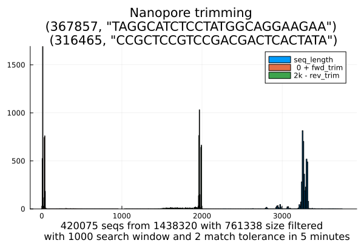

# utilities

### poretrim.jl

Julia version 1.10.5

`poretrim.jl` is a julia utility for trimming Nanopore `fastq.gz` datasets
using primers known to reside in the dataset.

usage:
```
julia poretrim.jl infile.fastq.gz outfile.fastq.gz fwd_primer rev_primer primer_discards.fastq.gz length_discards.fastq.gz
```

The first four parameters are mandatory but the last two are optional.

for example:
```
julia poretrim.jl infile.fastq.gz outfile.fastq.gz TAGGCATCTCCTATGGCAGGAAGAA CCGCTCCGTCCGACGACTCACTATA
```

the tool will read sequence records, search for the forward and reverse primers,
and output a sequence record with the sequence trimmed upto but not including the primers.
If the primer pair is not found the reverse complement sequence is searched and
if still not found the sequence is discarded and written to the discard files if provided on the command line.

The tool reports every 10K sequences with matching primers and the tool produces a histogram 
displaying various sequence counts such as the one below.



When you first run the tool, julia will use the `Manifest` and `Project` files in this `utilities` 
directory to install the required libraries locally. Thereafter run times should improve.

### umi_analysis.jl

This tool generates scatter plots that show family sizes for each UMI that 
survives filtering.

### MergeTreeplot.jl

This tool merges two fasta files from the same sample but different datasets
and then generates a tree plot that shows how UMI family sizes are distributed
over UMIs

